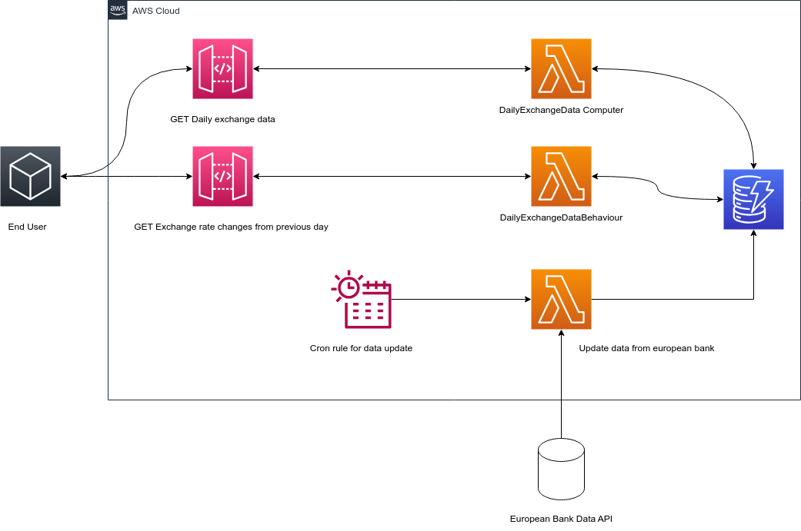

# Currency Exchange APP RestAPIs
## Data Source

European Central Bank Data (https://www.ecb.europa.eu/stats/policy_and_exchange_rates/euro_reference_exchange_rates/html/index.en.html). Exchange rates will be be fetched every day and stored in a database.

## API Endpoints

API Client to see current exchange rates. \
API Client how the exchange rate has changed compared to the previous day.

## AWS Services

AWS Lambda \
AWS CloudFormation \
AWS CloudWatch \
AWS API Gateway \
AWS DynamoDB

## Architecture

## Cloud Formation Stack

Please use app_cloudformation.yml file for the stack deployment

